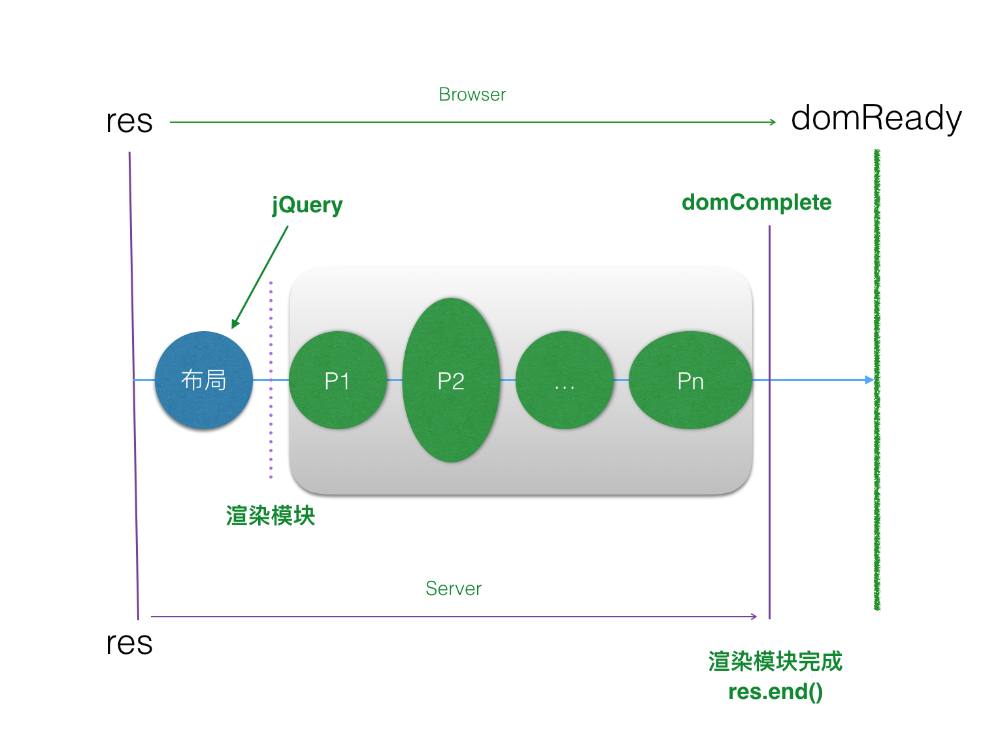

## 组件

- bigview（Node.js）视图的基类
- biglet（Node.js）模块的基类
- bigview.js（前端引用）

## 特性

- 模块化
- 具有测试性
- 支持mock数据
- 生成html片段（便于对比）
- 提供Scaffold（bigview-cli）
- 提供调试UI（bigconsole）

## 功能点

- 支持静态布局和动态布局
- 支持5种bigpipe渲染模式
  - parallel.js   并行模式， 先写布局，并行请求，但在获得所有请求的结果后再渲染
  - pipeline.js  (默认) 管线模式：即并行模式， 先写布局，并行请求，并即时渲染
  - reduce.js    顺序模式： 先写布局，按照pagelet加入顺序，依次执行，写入
  - reducerender.js 先写布局，然后顺序执行，在获得所有请求的结果后再渲染
  - render.js 一次渲染模式：即普通模式，不写入布局，所有pagelet执行完成，一次写入到浏览器。支持搜索引擎，用来支持那些不支持JS的客户端。
- 支持子pagelet，无限级嵌套
- 支持根据条件渲染模板，延时输出布局
- bigview支持错误模块显示，仅限于布局之前

## 感谢

- 冯地木
- 张凯mik
- 张代应
- 陈愉镔
- 马涛told

## 《Bigview组件引发的各种思考》

【技术讲堂】《Bigview组件引发的各种思考》将于3月1x日19:00东升4层xxx培训教室（一）举行~
欢迎大家前来交流~
 
【分享人】桑世龙
【部门】机票事业部 - 用户产品部 - 前端架构 
【报名】待定
 
 
【主要内容】
Bigview组件是机票前端自研的组件，用于提高模块化和前端开发效率。这次分享会包括：Bigview组件/模块化/异步流程控制/bs架构中的浏览器渲染等，根据原理和开发过程谈谈模块化和前端开发效率以及Node.js的技巧、方法和注意事项。
 
 
 
平台事业部/研发支持/技术培训
邮箱：jishupeixun@qunar.com

## 《一讲就懂的异步流程控制》

【技术讲堂】《一讲就懂的异步流程控制》将于3月1x日19:00东升4层xxx培训教室（一）举行~
欢迎大家前来交流~
 
【分享人】桑世龙
【部门】机票事业部 - 用户产品部 - 前端架构 
【报名】待定
 
 
【主要内容】
异步流程控制是各工种都会遇到的问题，更好的梳理流程控制对于开发（前端、后端、移动端）和产品都是至关重要的。本次分享会以Promise/A+规范为主，穿插各种业务场景理解，正确做到一讲就懂，并能够让大家真正受益。
 
 
 
平台事业部/研发支持/技术培训
邮箱：jishupeixun@qunar.com

## 外部沟通方式

团队互访

- 主场方
	- 提供场地，会议室、主持人
	- 指定大方向话题
	- 每次3到4个分享
	- 上午10点到12点间
- 到访方
	- 主题分享
	- 互动沟通、答疑

主题涵盖：技术栈、管理经验、疑问、探索等，业务之上相关的都可以。

运营：双方技术团队公众号、微博等推送活动信息，在征得双方同意后，可以公开交流内容（可能会有私密的沟通）、互推互助、提高各自公司在技术圈内的影响力。
